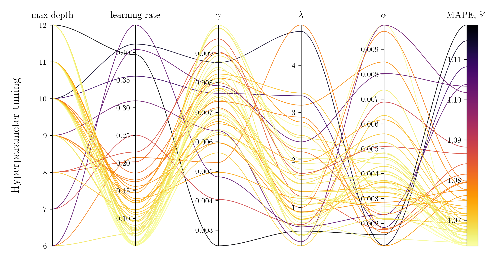

```console
tommaso@github:~$ ./welcome.sh
```

```
 _____________________________________
< Welcome to my personal GitHub page! >
 ------------------------------------- 
        \   ^__^
         \  (oo)\_______
            (__)\       )\/\
                ||----w |
                ||     ||
```

 

```
tommaso@github
-------------------------
🏠 BSc in Physics at University of Padua 
🌆 MSc in Statistics at Imperial College London
🔎 Statistics and Machine Learning
❤️ Python, R, C++ 
📧 E-Mail: tommaso.ferracci@gmail.com
📬 LinkedIn: 
<pre>  
    <code>
        <a href="https://www.linkedin.com/in/tommaso-ferracci">tommaso</a>
    </code> 
</pre>
```
